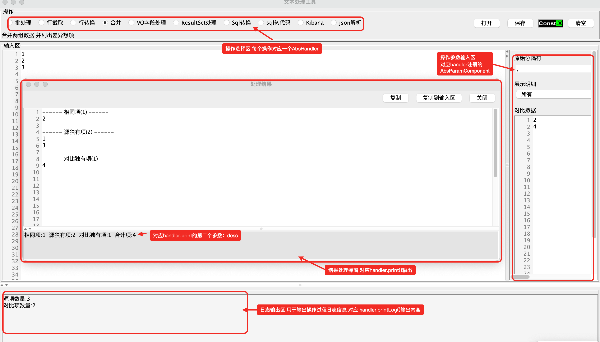

# Text 模块

基于 Swing 的文本处理 GUI 工具，提供可视化的文本批量处理功能，包括数据格式化、截取提取、差异比对等操作。


## 核心功能

### 1. 文本处理工具 (`TextTool`)

主窗口 GUI 应用，提供：
- **处理器注册**：通过 `regHandler()` 注册自定义处理器，以单选按钮形式展示
- **输入区域**：左侧带行号的主输入区 + 右侧动态参数面板
- **输出区域**：弹出对话框展示处理结果和统计信息
- **文件操作**：打开文件（自动识别编码）、保存结果
- **结果操作**：复制结果、复制到输入区继续处理




### 2. 处理器体系 (`AbsHandler`)

#### 抽象基类
```java
public abstract class AbsHandler {
    // 处理逻辑
    public abstract void handle(String input, Map<String,Object> params);
    // 处理器名称（显示在单选按钮上）
    public abstract String getName();
    // 功能描述
    public abstract String getDescription();
    // 是否允许退出（处理中时阻止关闭）
    public boolean canExit();
}
```

#### 输出方法
```java
print(String result, String stats)  // 输出结果和统计信息
printLog(String log)                 // 输出日志
printWarn(String warning)            // 输出警告（红色提示）
printSuccess(String message)         // 输出成功提示
clear() / clearLog() / clearWarn()  // 清除输出
```

### 3. 参数组件体系 (`AbsParamComponent`)

#### 抽象基类
```java
public abstract class AbsParamComponent<T> {
    private String key;              // 参数键名
    private String description;      // 参数描述
    private T defaultValue;          // 默认值
    private boolean visable;         // 是否可见
    private boolean enabled;         // 是否可用

    public abstract JComponent initUI();   // 初始化 UI
    public abstract T getValue();          // 获取值
    public abstract void setValue(T value); // 设置值
    public abstract void clear();          // 清空
}
```

#### 具体实现

| 组件 | 类型 | 功能 |
|------|------|------|
| `TextInputParamComponent` | String | 单行文本输入或多行文本区域（带行号） |
| `BooleanParamComponent` | Boolean | 是/否下拉选择（继承 ComboBoxParamComponent） |
| `ComboBoxParamComponent<T>` | T | 通用下拉选择框，支持值变化监听 |
| `FileChooseParamComponent` | List<File> | 文件/目录选择器，支持多选、过滤、递归 |

### 4. 输出接口 (`IPrinter`)

```java
public interface IPrinter {
    void print(String str, String desc);    // 输出结果和描述
    void clear();                           // 清除结果
    void printLog(String str);              // 输出日志
    void clearLog();                        // 清除日志
    void printWarn(String str);             // 输出警告
    void printSuccess(String str);          // 输出成功提示
    void clearWarn();                       // 清除警告
}
```

## 内置处理器

### 1. 批处理 (`BatchHandler`)

文本行数据批量格式化处理。

**参数配置**：
| 参数 | 描述 | 默认值 |
|------|------|--------|
| `limitPerLine` | 每行项目数 | 10 |
| `maxIn` | 每组项目数 | 10000 |
| `split` | 原始分隔符 | , |
| `isString` | 加工方式：加L/加单引号/加双引号/批量替换/无 | 无 |
| `join` | 连接符 | , |
| `rmMuti` | 是否去重 | 是 |
| `alignment` | 是否对齐 | 是 |
| `sort` | 是否排序 | 否 |
| `text` | 处理模板（批量替换模式） | 隐藏 |

**功能示例**：
- 输入 `a,b,c`，选择"加单引号"，输出 `'a','b','c'`
- 输入多行数据，自动去重、分组、格式化
- 支持模板替换：`${0}` 代表第一个元素，`${1}` 代表第二个...

### 2. 行截取 (`LineCutHandler`)

按关键字对每行数据进行截取提取。

**参数配置**：
| 参数 | 描述 | 默认值 |
|------|------|--------|
| `begin` | 截取前特征 | - |
| `end` | 截取后特征 | - |
| `match` | 必须同时匹配 | 是 |
| `rmMuti` | 是否去重 | 是 |
| `nulLine` | 无匹配行是否展示 | 否 |
| `files` | 选择文件（可选） | - |

**功能示例**：
- 输入 `user:admin@example.com`，设置 `begin=user:`，`end=@`，输出 `admin`
- 支持文件批量处理
- 自动统计有效项和重复项

### 3. 合并 (`LineMergeHandler`)

两组数据差异比对。

**参数配置**：
| 参数 | 描述 | 默认值 |
|------|------|--------|
| `split` | 原始分隔符 | , |
| `source` | 对比数据（多行输入） | - |

**输出结果**：
- 相同项列表
- 源数据独有项
- 对比数据独有项

## 模块结构

```
text/
├── pom.xml                                    # Maven 配置（依赖 base-utils）
└── src/main/java/idv/const_x/swing/text/
    ├── TextTool.java                          # 主工具窗口
    ├── IPrinter.java                          # 输出接口
    ├── handler/                               # 处理器
    │   ├── AbsHandler.java                   # 处理器抽象基类
    │   ├── BatchHandler.java                 # 批处理处理器
    │   ├── LineCutHandler.java               # 行截取处理器
    │   └── LineMergeHandler.java             # 合并比对处理器
    └── param/                                 # 参数组件
        ├── AbsParamComponent.java            # 参数组件抽象基类
        ├── TextInputParamComponent.java      # 文本输入组件
        ├── BooleanParamComponent.java        # 布尔选择组件
        ├── ComboBoxParamComponent.java       # 下拉选择组件
        └── FileChooseParamComponent.java     # 文件选择组件
```

## 使用示例

### 1. 启动工具
```java
// 基本启动
new TextTool().regHandler(new BatchHandler()).run();

// 注册多个处理器
new TextTool()
    .regHandler(new BatchHandler())
    .regHandler(new LineCutHandler())
    .regHandler(new LineMergeHandler())
    .run();

// 关闭时退出程序
new TextTool()
    .regHandler(new BatchHandler())
    .exitWhenClose(true)
    .run();
```

### 2. 创建自定义处理器
```java
public class MyHandler extends AbsHandler {

    public MyHandler() {
        // 添加参数组件
        TextInputParamComponent param1 = new TextInputParamComponent("param1");
        param1.setDescription("参数1描述");
        param1.setDefaultValue("默认值");
        super.addParamComponent(param1);

        BooleanParamComponent flag = new BooleanParamComponent("flag");
        flag.setDescription("是否启用");
        flag.setDefaultValue(true);
        super.addParamComponent(flag);
    }

    @Override
    public void handle(String input, Map<String, Object> params) {
        String param1 = (String) params.get("param1");
        boolean flag = (boolean) params.get("flag");

        StringBuilder result = new StringBuilder();
        // 处理逻辑...

        super.print(result.toString(), "统计信息");
    }

    @Override
    public String getName() {
        return "自定义处理";
    }

    @Override
    public String getDescription() {
        return "自定义处理器功能描述";
    }
}
```

### 3. 创建自定义参数组件
```java
public class NumberParamComponent extends AbsParamComponent<Integer> {

    private JSpinner spinner;

    public NumberParamComponent(String key) {
        super(key);
    }

    @Override
    protected JComponent initUI() {
        JPanel panel = new JPanel(new VFlowLayout());
        panel.add(new JLabel(getDescription()));
        spinner = new JSpinner();
        if (getDefaultValue() != null) {
            spinner.setValue(getDefaultValue());
        }
        panel.add(spinner);
        return panel;
    }

    @Override
    public Integer getValue() {
        return (Integer) spinner.getValue();
    }

    @Override
    public void setValue(Integer value) {
        spinner.setValue(value);
    }

    @Override
    public void clear() {
        spinner.setValue(0);
    }
}
```

### 4. ComboBox 组件值变化监听
```java
ComboBoxParamComponent<Integer> mode = new ComboBoxParamComponent<>("mode");
mode.setDescription("处理模式");
mode.addItem("模式A", 1);
mode.addItem("模式B", 2);
mode.addChangeListener((oldVal, newVal) -> {
    if (newVal == 2) {
        otherParam.setVisable(true);
    } else {
        otherParam.setVisable(false);
    }
});
```

## 依赖说明

- **base-utils**：基础工具类（Swing 扩展组件、字符串处理、文件操作等）
  - `VFlowLayout`：垂直流式布局
  - `LineNumberHeaderView`：行号视图
  - `JSplitPaneExt`：可调整分割比例的分割面板
  - `LimitativeDocument`：限制长度的文档模型
  - `JOptionPaneExt`：扩展的对话框
  - `StringExtUtils`：字符串工具
  - `FileUtils`：文件工具（编码识别）
  - `OSUtils`：系统工具（剪贴板、桌面路径）
  - `ListSpliter`：列表分割器

## 设计模式

- **模板方法**：`AbsHandler` 定义处理流程框架，子类实现具体逻辑
- **策略模式**：不同处理器实现不同的处理策略，可动态切换
- **建造者模式**：`TextTool.regHandler().exitWhenClose().run()` 链式配置
- **工厂模式**：`AbsParamComponent.initUI()` 延迟创建 UI 组件
- **观察者模式**：`ComboBoxParamComponent.IChangeListener` 监听值变化

## GUI 界面布局

```
+--------------------------------------------------+
| [操作]                                           |
| ○ 批处理  ○ 行截取  ○ 合并    [打开][保存][执行][清空] |
| 功能描述...                                       |
+--------------------------------------------------+
| [输入区]                      | [参数面板]        |
| 行号 | 文本内容               | 参数1描述         |
|   1  | ...                   | [输入框]          |
|   2  | ...                   | 参数2描述         |
| ...  | ...                   | [下拉框]          |
+--------------------------------------------------+
| [日志区]                                         |
| 处理日志...                                       |
+--------------------------------------------------+

[处理结果对话框]
+------------------------------------------+
| [复制] [复制到输入区] [关闭]              |
+------------------------------------------+
| 行号 | 处理结果                           |
|   1  | ...                               |
|   2  | ...                               |
+------------------------------------------+
| 统计信息                                  |
| 合计:xx项, 有效xx项, 重复xx项            |
+------------------------------------------+
```